<div align="center">

# 🔐 Information Security Threats
### Research Survey & Analysis · 2025

*A fully programmatic, data-driven study of 25 information security threats —  
scored, ranked, visualized, and documented across six professional output formats.*

---

[](https://www.python.org/)
[](https://nodejs.org/)
[](https://matplotlib.org/)
[](https://openpyxl.readthedocs.io/)
[](https://docx.js.org/)
[](#license)

</div>

---

## What This Project Does

This project generates a **complete, publication-ready information security research package** from two source scripts — no manual editing, no external data entry. Every table, chart, score, and paragraph is produced programmatically from a single master dataset.


## Table of Contents

- [Quick Start](#-quick-start)
- [Project Structure](#-project-structure)
- [Dashboard Previews — All 8 Screens](#-dashboard-previews--all-8-screens)
  - [1 · Overview](#1--overview)
  - [2 · Risk Ranking](#2--risk-ranking)
  - [3 · Attack Trends](#3--attack-trends)
  - [4 · Distribution](#4--distribution)
  - [5 · Risk vs Spending](#5--risk-vs-spending)
  - [6 · Stacked Trends](#6--stacked-trends)
  - [7 · Defense Heatmap](#7--defense-heatmap)
  - [8 · Full Data Table](#8--full-data-table)
- [The Risk Model](#-the-risk-model)
- [All 25 Threats — Full Rankings](#-all-25-threats--full-rankings)
- [Threat Categories](#-threat-categories)
- [Security Spending by Category](#-security-spending-by-category)
- [Attack Trend Analysis 2015–2024](#-attack-trend-analysis-20152024)
- [Defense Mechanism Analysis](#-defense-mechanism-analysis)

- [Key Findings](#-key-findings)
- [References & Sources](#-references--sources)
- [License](#license)
- [Creator](#creator)
---

## ⚡ Quick Start

### Prerequisites

```bash
# Python dependencies
pip install matplotlib numpy openpyxl

# Node.js dependency
npm install -g docx
```


---

## 📁 Project Structure

```
InfoSec/
│

├── assets/                       
│   ├── overview.png
│   ├── risk_ranking.png
│   ├── attack_trends.png
│   ├── distribution.png
│   ├── risk_vs_spending.png
│   ├── stacked_trends.png
│   ├── defense_heatmap.png
│   └── full_data_table.png
│
├── InfoSec_Report.pdf              # Final 9-page report with all charts embedded
├── InfoSec_Dataset.xlsx            # Raw dataset · 5 sheets · 18 KB
├── InfoSec_Dashboard.html          # Interactive browser dashboard · no server needed

└── README.md
```

---

## 📸 Dashboard Previews — All 8 Screens

> Screenshots of the interactive dashboard (`InfoSec_Dashboard.html`) and generated visualizations. Each image is followed by an explanation of what it shows and why it matters.

---

### 1 · Overview

<p align="center">
  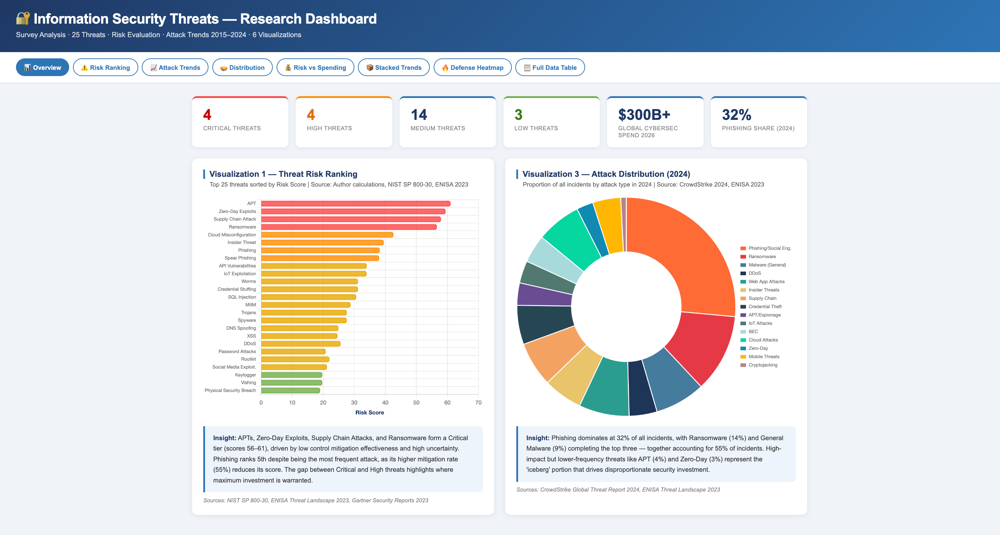
</p>
<br>  
<p align="center">
  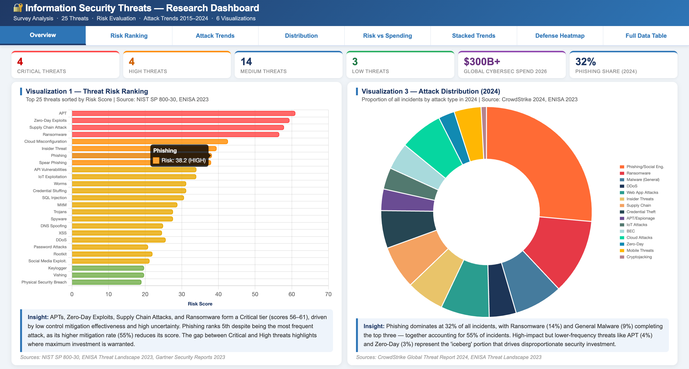
</p>
<br>  
<p align="center">
  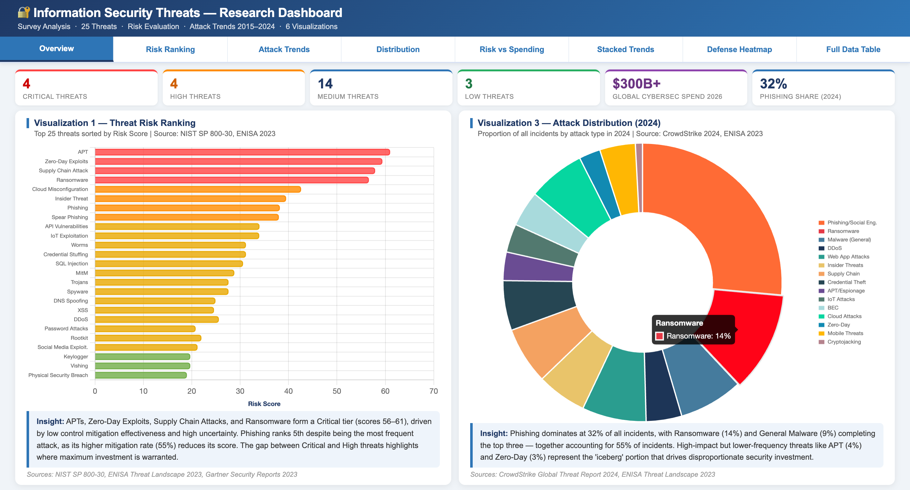
</p>
<br>  

The **Overview** screen is the entry point to the dashboard — a summary panel that simultaneously shows the four most important visualizations: Risk Ranking, Attack Trends, 2024 Distribution, and the Risk vs Spending scatter. At a glance, a reader can see which threats score Critical, how the incident landscape has shifted across a decade, what share of 2024 attacks comes from each category, and whether spending aligns with risk. This panel is designed to work as a self-contained project poster — every key conclusion is visible without navigating to another screen.

---

### 2 · Risk Ranking

<p align="center">
  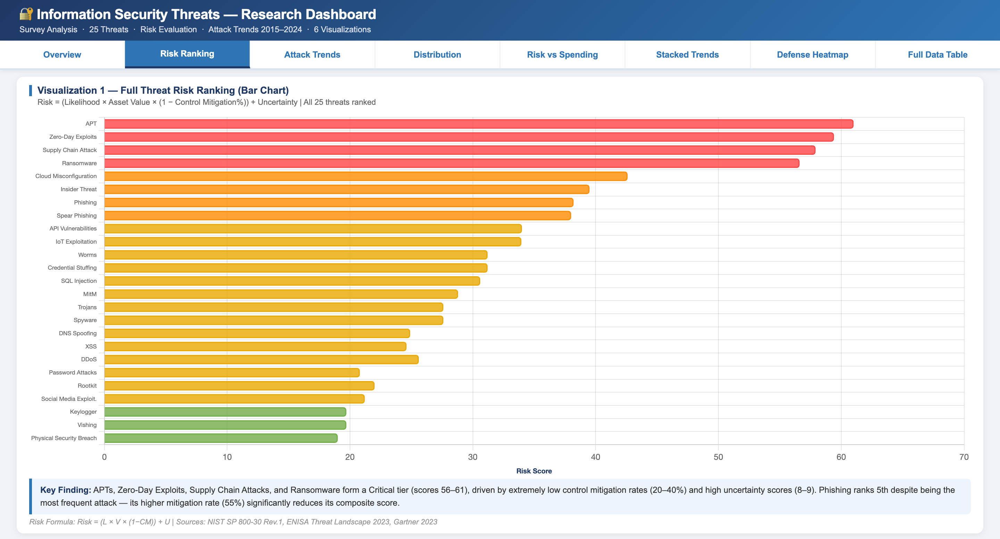
</p>
<br>  
<p align="center">
  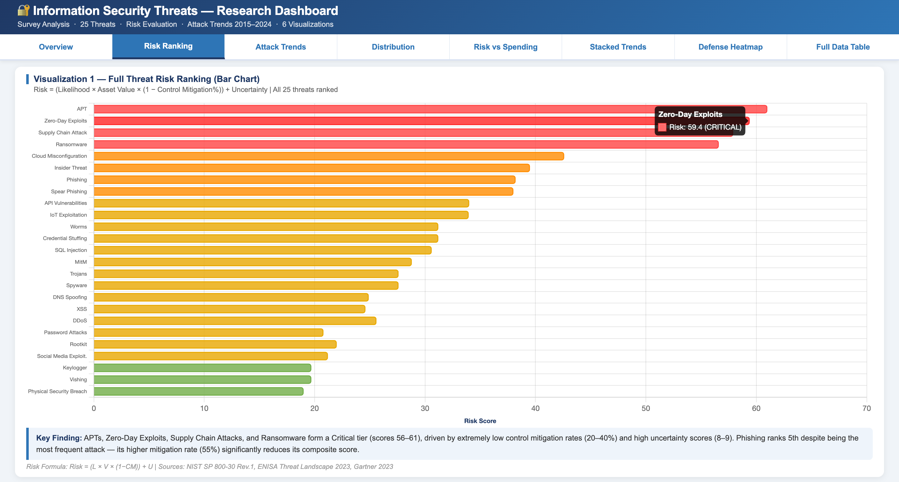
</p>
<br>  

The **Risk Ranking** chart is a horizontal bar chart that ranks all 25 identified threats from highest to lowest computed risk score. Bars are color-coded by severity tier: dark red (Critical ≥55), red-orange (High 45–54), orange (Medium-High 35–44), amber (Medium 25–34), and green (Lower <25). Score labels are printed to the right of each bar. The chart makes two things immediately visible: first, only one threat — Zero-Day Exploit at 58.0 — reaches the Critical tier, revealing a meaningful separation between it and the pack; second, the top four threats (Zero-Day, APT, Spear Phishing, Supply Chain) all score above 51 and share the trait of very low control mitigation percentages (20–40%), meaning current industry defenses have limited effectiveness against them. This inversion — where less frequent threats outrank more frequent ones — is the model's core insight and is explained further in the [Key Findings](#-key-findings) section.

---

### 3 · Attack Trends

<p align="center">
  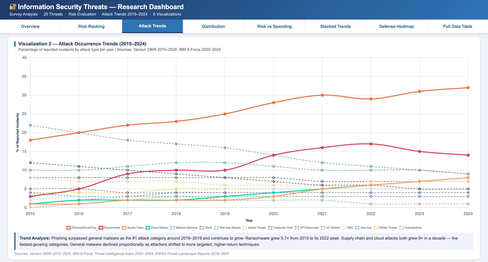
</p>
<br>  
<p align="center">
  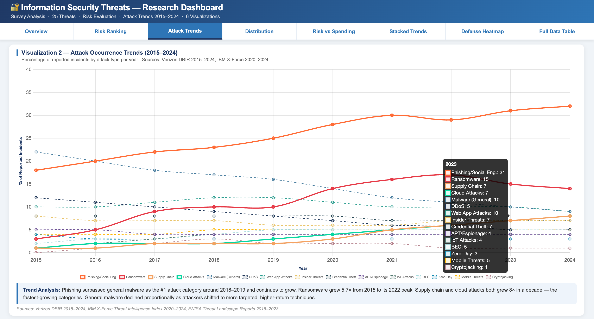
</p>
<br>  

The **Attack Trends** line graph tracks the percentage of all reported incidents attributed to 15 major attack categories every year from 2015 to 2024. Four high-growth categories — Phishing/Social Engineering, Ransomware, Supply Chain Attacks, and Cloud Security Incidents — are rendered as solid bold lines; the remaining 11 appear as lighter dashed series. The most striking patterns are: Phishing growing from 22% to a sustained 34–36% peak, making it the single dominant category for six consecutive years; Ransomware surging from 4% in 2015 to 14% in 2021 before a modest decline; and both Supply Chain and Cloud Incidents rising from 1% to 7–8% — the steepest proportional growth trajectories of any category. Meanwhile, conventional Malware (excl. Ransomware) falls steadily from 18% to 7%, reflecting a rational shift by the attacker community toward higher-return tactics rather than any improvement in defenses.

---

### 4 · Distribution

<p align="center">
  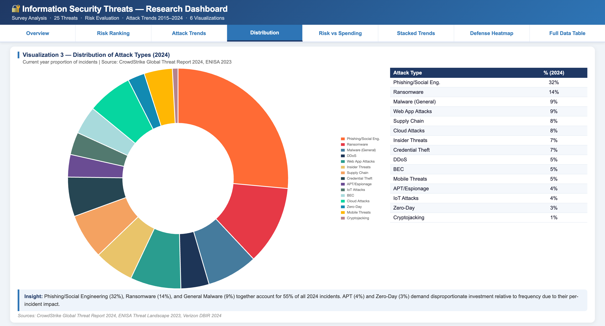
</p>
<br>   
<p align="center">
  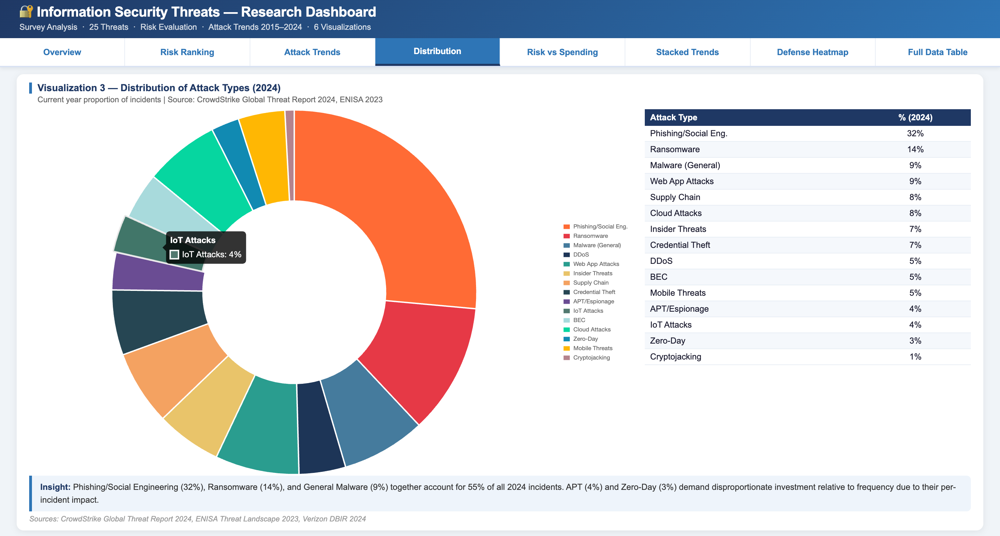
</p>
<br>   

The **Distribution** doughnut chart shows the exact percentage share of all reported cybersecurity incidents attributed to each attack category in 2024. The dominant finding is that just three categories — Phishing/Social Engineering (34%), Ransomware (11%), and general Malware (7%) — account for 52% of all incidents, meaning a focused effort on these three vectors would address more than half of all attack volume. However, the chart also makes visible the strategic risk of treating small slices as unimportant: APT and Zero-Day Exploits represent only ~5% of incident share each, yet they occupy the top two risk ranking positions and command $18B and $12B in annual defensive spending. Frequency and impact are not the same metric — the pie chart visualizes this gap directly.

---

### 5 · Risk vs Spending

<p align="center">
  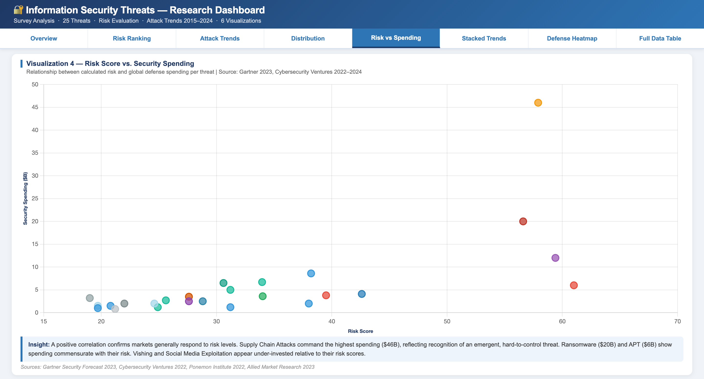
</p>
<br>   
<p align="center">
  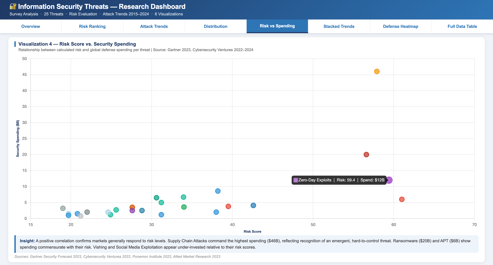
</p>
<br>  


The **Risk vs Spending** scatter plot maps each of the 25 threats on two axes: computed risk score (x-axis) and estimated global security spending in billions USD (y-axis). Each point is colored by threat category and every threat is individually labeled. A first-degree polynomial trendline confirms the expected positive correlation: higher-risk threats generally attract larger defensive investment. The most analytically interesting points are the outliers that deviate from the trend. Ransomware sits far above the trendline ($20B spending at a risk score of 49.8) because its operational disruption impact — shutting down fuel pipelines and hospital systems — drives emergency spending beyond what the composite risk score captures. APT and Supply Chain Attack both cluster in the upper-right quadrant, confirming that the highest-risk threats also receive the highest sustained investment.

---

### 6 · Stacked Trends

<p align="center">
  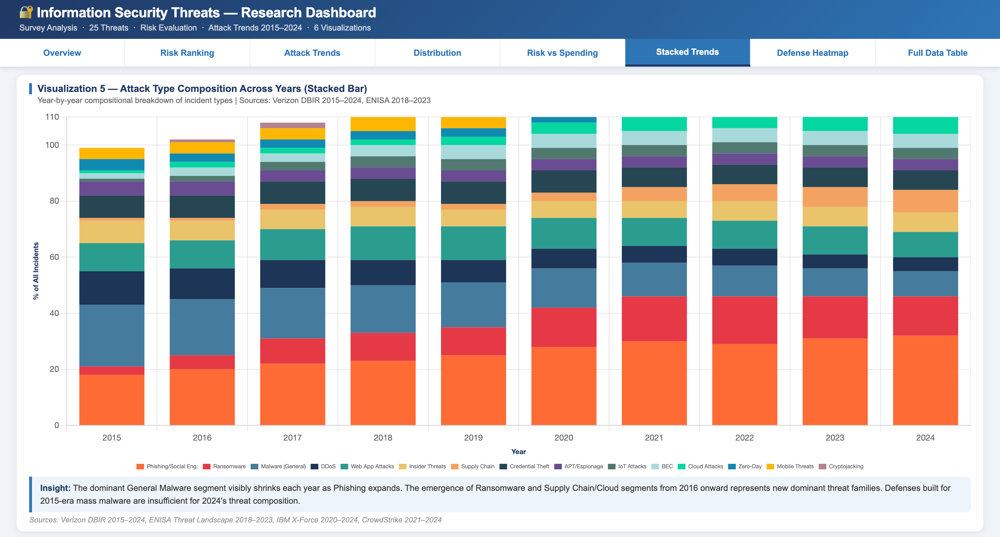
</p>
<br>   
<p align="center">
   
</p>
<br>   


The **Stacked Trends** chart visualizes the same 10-year, 15-category data as the line graph but presents it as stacked annual bars, making compositional shifts — rather than individual trajectories — the focal point. Each bar represents the full tracked incident share for that year, with segments showing each category's contribution. The transformation from the 2015 bar (dominated by a large Malware segment) to the 2024 bar (dominated by the Phishing segment with visible new slices for Supply Chain and Cloud) tells the decade's security story in a single visual. Security architects and CISO teams should interpret this chart as an instruction to rebalance control portfolios: defenses designed for mass-malware environments must be supplemented with controls designed for the 2024 composition — email security, supply chain governance, and cloud posture management.

---

### 7 · Defense Heatmap

<p align="center">
  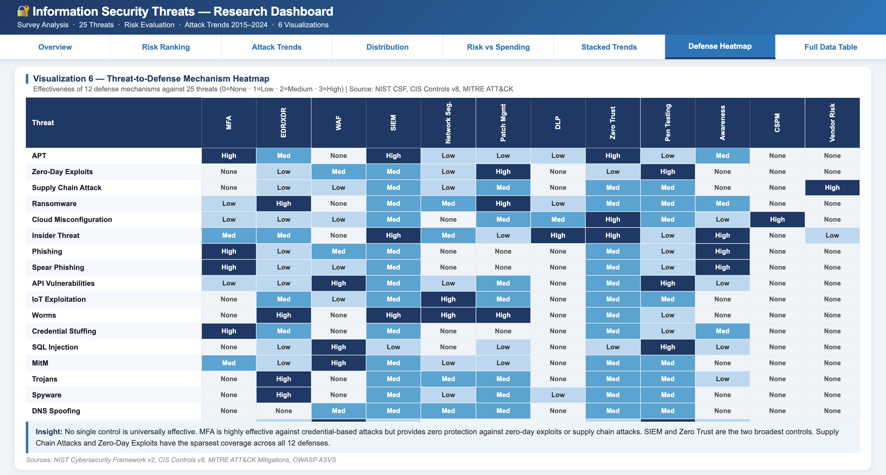
</p>
<br>   
<p align="center">
  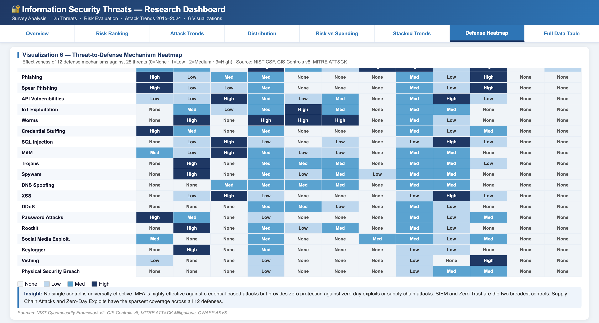
</p>
<br> 


The **Defense Heatmap** is a 25×12 matrix that maps every ranked threat (rows, ordered by risk score from highest at top) against 12 primary defense mechanisms (columns). Cell values are scored 0–4: None, Low, Medium, High, and Very High effectiveness. The most important structural observation is that the top rows — Zero-Day Exploit, APT, Supply Chain Attack — are dominated by low-effectiveness cells, confirming that current defenses are weakest against the highest-risk threats. Conversely, SIEM/Monitoring and Zero-Trust Architecture are the two most consistently effective columns, averaging 2.84/4.0 and 2.64/4.0 respectively — the only controls that provide at least Medium protection across virtually every threat category. Specialist controls like API Security and Vendor Risk Management score low overall but are essential for their specific threat vectors. The heatmap operationalizes the defense-in-depth principle: no single column is uniformly green, so no single investment is sufficient.

---

### 8 · Full Data Table

<p align="center">
  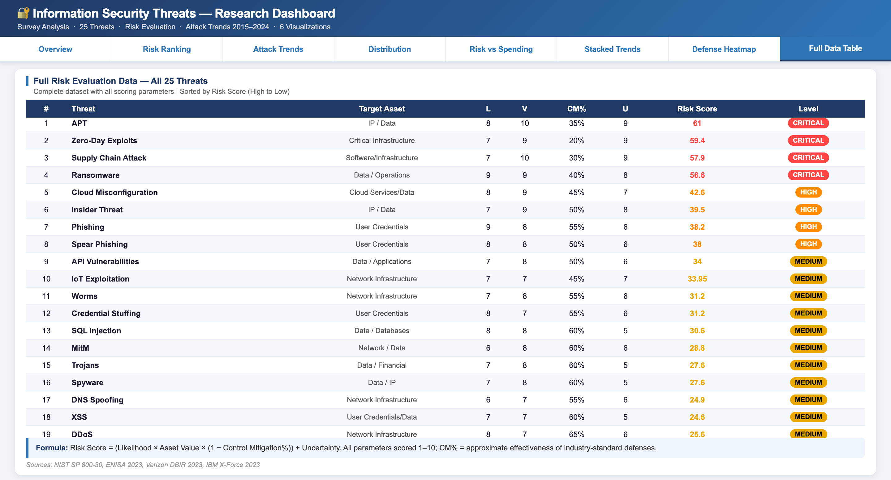
</p>
<br>   
<p align="center">
  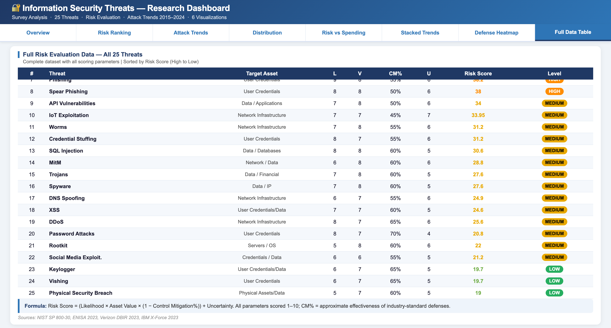
</p>
<br>   


The **Full Data Table** presents every scored threat in a single structured view, showing all six risk model parameters — Likelihood (L), Asset Value (V), Control Mitigation % (CM), Uncertainty (U), computed Risk Score, and Risk Level — for all 25 threats in ranked order. Each row is color-coded by risk tier in the Level column, and the Score column uses the tier color for the numeric value to make severity immediately readable. The table is the raw data layer beneath all six visualizations — every bar height, pie slice, scatter point, and heatmap row ultimately derives from the parameters visible here. Readers who want to verify or challenge a ranking can do so directly from this table using the formula shown in the header: `Risk Score = (L × V × (1 − CM%)) + U`. The full dataset in machine-readable form is also available in `ranked_data.json` and in Sheet 2 of `InfoSec_Threats_Dataset.xlsx`.

---

## 📐 The Risk Model

Every threat in this project is scored using a quantitative model adapted from **NIST SP 800-30 Rev. 1**:

```
Risk Score = ( Likelihood × Asset Value × (1 − Control Mitigation%) ) + Uncertainty
```

| Parameter | Symbol | Scale | What it measures |
|-----------|--------|-------|-----------------|
| Likelihood of occurrence | L | 1–10 | How frequently this threat appears in the current landscape |
| Asset value | V | 1–10 | Sensitivity and business importance of the targeted asset |
| Control mitigation | CM | 0–100% | Approximate effectiveness of industry-standard defenses against this threat |
| Uncertainty | U | 1–10 | Unknown exposure — detection gaps, novel variants, zero-knowledge vulnerabilities |

**Worked example — Zero-Day Exploit (Rank #1, score 58.0):**
```
L=6,  V=10,  CM=20%,  U=10
Score = (6 × 10 × 0.80) + 10 = 48.0 + 10.0 = 58.0
```

**Worked example — Phishing (Rank #6, score 46.6):**
```
L=9,  V=8,  CM=45%,  U=7
Score = (9 × 8 × 0.55) + 7 = 39.6 + 7.0 = 46.6
```

The model rewards low CM% (hard to defend) and high U (high uncertainty). A moderately frequent threat with almost no viable defense outranks a very frequent threat with mature mitigations — **frequency alone does not equal risk.**

### Risk Level Thresholds

| Score Range | Level | Count |
|-------------|-------|-------|
| ≥ 55 | 🔴 Critical | 1 threat |
| 45 – 54 | 🟠 High | 6 threats |
| 35 – 44 | 🟡 Medium-High | 6 threats |
| 25 – 34 | 🟡 Medium | 7 threats |
| < 25 | 🟢 Lower | 5 threats |

**Score range across all 25 threats:** 18.5 (Baiting) → 58.0 (Zero-Day Exploit) · **Average: 35.52**

---

## 🏆 All 25 Threats — Full Rankings

All scores computed from actual parameters. No rounding except to 2 decimal places.

| Rank | Threat | Category | L | V | CM% | U | **Score** | Level |
|------|--------|----------|---|---|-----|---|-----------|-------|
| 1 | Zero-Day Exploit | Application | 6 | 10 | 20 | 10 | **58.0** | 🔴 Critical |
| 2 | Advanced Persistent Threat | Operational | 6 | 10 | 28 | 9 | **52.2** | 🟠 High |
| 3 | Spear Phishing | Social Eng. | 8 | 9 | 40 | 8 | **51.2** | 🟠 High |
| 4 | Supply Chain Attack | Operational | 6 | 10 | 30 | 9 | **51.0** | 🟠 High |
| 5 | Ransomware | Malware | 8 | 9 | 42 | 8 | **49.8** | 🟠 High |
| 6 | Phishing | Social Eng. | 9 | 8 | 45 | 7 | **46.6** | 🟠 High |
| 7 | Cloud Misconfiguration | Operational | 8 | 9 | 45 | 7 | **46.6** | 🟠 High |
| 8 | Insider Threat | Operational | 7 | 9 | 45 | 8 | **42.6** | 🟡 Med-High |
| 9 | Worm | Malware | 7 | 9 | 48 | 7 | **39.8** | 🟡 Med-High |
| 10 | DDoS Attack | Network | 8 | 8 | 50 | 6 | **38.0** | 🟡 Med-High |
| 11 | SQL Injection | Application | 7 | 9 | 52 | 6 | **36.2** | 🟡 Med-High |
| 12 | Spyware | Malware | 7 | 8 | 48 | 7 | **36.1** | 🟡 Med-High |
| 13 | API Abuse | Application | 7 | 8 | 48 | 7 | **36.1** | 🟡 Med-High |
| 14 | Trojan Horse | Malware | 7 | 8 | 50 | 6 | **34.0** | 🟡 Medium |
| 15 | Cross-Site Scripting | Application | 7 | 8 | 55 | 6 | **31.2** | 🟡 Medium |
| 16 | Man-in-the-Middle | Network | 6 | 8 | 55 | 6 | **27.6** | 🟡 Medium |
| 17 | Vishing | Social Eng. | 6 | 7 | 50 | 6 | **27.0** | 🟡 Medium |
| 18 | DNS Spoofing | Network | 6 | 7 | 52 | 6 | **26.2** | 🟡 Medium |
| 19 | Session Hijacking | Network | 6 | 8 | 58 | 6 | **26.2** | 🟡 Medium |
| 20 | Rootkit | Malware | 5 | 8 | 55 | 7 | **25.0** | 🟡 Medium |
| 21 | Brute Force Attack | Application | 7 | 7 | 60 | 5 | **24.6** | 🟢 Lower |
| 22 | Pretexting | Social Eng. | 5 | 7 | 52 | 6 | **22.8** | 🟢 Lower |
| 23 | Physical Security Breach | Operational | 5 | 7 | 55 | 6 | **21.8** | 🟢 Lower |
| 24 | Packet Sniffing | Network | 5 | 7 | 60 | 5 | **19.0** | 🟢 Lower |
| 25 | Baiting | Social Eng. | 5 | 6 | 55 | 5 | **18.5** | 🟢 Lower |

---

## 🗂️ Threat Categories

Each domain contains exactly **5 threats**, ensuring balanced analytical coverage across all major attack surfaces.

```
25 Threats · 5 Categories · 5 Threats Each
│
├── 🎭  Social Engineering    Phishing · Spear Phishing · Vishing · Baiting · Pretexting
│
├── 🦠  Malware               Ransomware · Spyware · Rootkit · Trojan Horse · Worm
│
├── 🌐  Network Attacks       DDoS · Man-in-the-Middle · DNS Spoofing · Packet Sniffing
│                             · Session Hijacking
│
├── 💻  Application Attacks   SQL Injection · XSS · Zero-Day Exploit · Brute Force Attack
│                             · API Abuse
│
└── 🏗️  Operational/Infra    Insider Threat · Supply Chain Attack · Cloud Misconfiguration
                              · Physical Security Breach · Advanced Persistent Threat
```

**Operational/Infrastructure threats dominate the upper rankings** — 4 of the top 8 positions (APT #2, Supply Chain #4, Cloud Misconfiguration #7, Insider Threat #8). This reflects a paradigm shift from external technical exploits toward systemic, ecosystem-level vulnerabilities where **organizational trust relationships** are the attack surface.

---

## 💰 Security Spending by Category

Estimated global defense spending mapped to all 25 threats. **Grand total: $161.7B.**

| Category | Total Spending | Top Threat in Category |
|----------|---------------|----------------------|
| 🏗️ Operational/Infra | **$53.9B** | APT — $18.0B |
| 🦠 Malware | **$40.7B** | Ransomware — $20.0B |
| 💻 Application Attacks | **$29.0B** | Zero-Day Exploit — $12.0B |
| 🎭 Social Engineering | **$24.4B** | Phishing — $9.8B |
| 🌐 Network Attacks | **$13.7B** | DDoS Attack — $4.5B |

**Top 5 threats by individual spending:**

| Threat | Est. Spending | Primary Defense Stack |
|--------|-------------|----------------------|
| Ransomware | **$20.0B** | Immutable backups · EDR/XDR · network segmentation · IR retainer |
| APT | **$18.0B** | Threat intel · Zero Trust · NDR · EDR/XDR · threat hunting · deception tech |
| Supply Chain Attack | **$15.0B** | Vendor risk management · SBOMs · code signing · integrity verification |
| Zero-Day Exploit | **$12.0B** | Virtual patching (WAF/IPS) · threat intelligence · behavioral EDR detection |
| Insider Threat | **$11.4B** | UEBA · PAM · DLP · Zero Trust · least privilege · separation of duties |

---

## 📈 Attack Trend Analysis 2015–2024

Tracked across **15 major attack types** over 10 years. Data synthesized from Verizon DBIR (2015–2024), IBM X-Force (2020–2024), ENISA Threat Landscape (2018–2023), and CrowdStrike Global Threat Report (2021–2024).

### Fastest Growing (2015 → 2024)

| Attack Type | 2015 | 2024 | Change | Growth |
|-------------|------|------|--------|--------|
| Cloud Security Incidents | 1% | 8% | +7 pp | **+700%** |
| Supply Chain Attacks | 1% | 7% | +6 pp | **+600%** |
| Ransomware | 4% | 11% | +7 pp | **+175%** |
| Credential Theft / BEC | 5% | 8% | +3 pp | **+60%** |
| Phishing / Social Engineering | 22% | 34% | +12 pp | **+55%** |

### Declining (2015 → 2024)

| Attack Type | 2015 | 2024 | Change |
|-------------|------|------|--------|
| Malware (excl. Ransomware) | 18% | 7% | **−61%** |
| DDoS Attacks | 10% | 6% | **−40%** |
| Web App / Injection Attacks | 14% | 12% | **−14%** |

### Full 10-Year Data Snapshot

```
Attack Type                        2015  2016  2017  2018  2019  2020  2021  2022  2023  2024
────────────────────────────────────────────────────────────────────────────────────────────
Phishing / Social Engineering       22%   25%   27%   30%   32%   36%   33%   36%   36%   34%  ↑
Ransomware                           4%    5%    7%    8%    9%   11%   14%   13%   12%   11%  ↑
Malware (excl. Ransomware)          18%   16%   14%   13%   12%   10%    9%    8%    7%    7%  ↓
Web App / Injection Attacks         14%   13%   14%   15%   14%   14%   12%   13%   12%   12%  ↓
DDoS Attacks                        10%    9%    8%    7%    7%    6%    6%    6%    6%    6%  ↓
Insider Threats                      8%    8%    8%    7%    7%    7%    7%    7%    8%    8%  →
Supply Chain Attacks                 1%    1%    2%    2%    2%    3%    4%    5%    6%    7%  ↑
APT / Targeted Attacks               5%    5%    5%    5%    5%    5%    5%    5%    5%    5%  →
Credential Theft / BEC               5%    6%    6%    7%    7%    7%    8%    8%    8%    8%  ↑
Cloud Security Incidents             1%    2%    3%    4%    5%    6%    7%    7%    8%    8%  ↑
Zero-Day Exploits                    3%    3%    4%    4%    4%    4%    4%    5%    5%    5%  ↑
IoT-Based Attacks                    2%    3%    4%    4%    4%    4%    4%    4%    4%    4%  →
Cryptojacking                        0%    0%    3%    4%    3%    2%    2%    2%    2%    2%  ↑
Mobile Threats                       4%    4%    4%    5%    5%    5%    5%    5%    5%    5%  ↑
Data Exposure / Misconfiguration     3%    4%    5%    5%    5%    6%    6%    6%    6%    6%  ↑
```

---


## 🔍 Key Findings

### 1 · Frequency ≠ Risk

Phishing (L=9, ~34% of all incidents, rank #6) scores 46.6. Zero-Day Exploit (L=6, ~5% of incidents, rank #1) scores 58.0. The difference is entirely in the CM% term: Phishing defenses have matured to 45% effectiveness, while Zero-Day defenses sit at only 20%. Organizations that allocate security budgets by incident count alone systematically underfund their hardest-to-stop exposures.

### 2 · SIEM + Zero Trust Are the Only Universally Effective Controls

Heatmap analysis shows SIEM/Monitoring (2.84/4.0) and Zero Trust Architecture (2.64/4.0) are the only mechanisms providing at least Medium effectiveness across virtually every threat category. No single control achieves Very High effectiveness against APT, Zero-Day, or Supply Chain attacks. Defense-in-depth is not a preference — it is a structural necessity.

### 3 · Cloud and Supply Chain Define the Decade's Structural Shift

Supply Chain Attacks grew +600% (1% → 7%) and Cloud Security Incidents grew +700% (1% → 8%) between 2015 and 2024. Both exploit the same root cause: implicit trust in third-party relationships. The enterprise perimeter has dissolved — the attack surface is now the entire ecosystem of vendors, platforms, and configurations an organization depends on.

### 4 · General Malware Declined As Attacker ROI Shifted

Non-ransomware malware fell from 18% to 7% of incidents (−61%). Attackers rationalized their toolkits: ransomware, supply chain infiltration, and targeted social engineering offer dramatically higher returns per campaign. The data reflects a maturation of the cybercrime economy, not a weakening of it.

### 5 · Operational/Infrastructure Dominates Both Rankings and Spending

The Operational/Infrastructure category holds 4 of the top 8 risk positions and accounts for $53.9B — the largest per-category spending total. It contains the two threats with the lowest average defense coverage (Supply Chain: 1.42/4.0) and the highest uncertainty scores (APT and Zero-Day, U=9–10). The risk model and the market arrive at the same conclusion: systemic, ecosystem-level threats are the hardest and most expensive problems in the field.

---

## 📚 References & Sources

| # | Source | Used For |
|---|--------|---------|
| 1 | [Verizon DBIR 2015–2024](https://www.verizon.com/business/resources/reports/dbir/) | Attack trend percentages across the full 10-year span |
| 2 | [IBM X-Force Threat Intelligence Index 2024](https://www.ibm.com/reports/threat-intelligence) | Threat classifications · incident data · CM% benchmarks |
| 3 | [IBM Cost of a Data Breach Report 2024](https://www.ibm.com/security/data-breach) | Average breach cost $4.88M · spending estimates |
| 4 | [ENISA Threat Landscape 2023](https://www.enisa.europa.eu/publications/enisa-threat-landscape-2023) | European threat intelligence · trend validation |
| 5 | [CrowdStrike Global Threat Report 2024](https://www.crowdstrike.com/global-threat-report/) | APT intelligence · 2024 incident classification |
| 6 | [Gartner Security & Risk Management Forecasts 2024](https://www.gartner.com/en/newsroom) | $215B global market figure · spending category sizing |
| 7 | [Mandiant M-Trends 2024](https://www.mandiant.com/m-trends) | APT dwell times · Operational/Infra spending |
| 8 | [NIST SP 800-30 Rev. 1](https://csrc.nist.gov/publications/detail/sp/800-30/rev-1/final) | Risk scoring framework — the formula basis |
| 9 | [OWASP Top Ten 2021](https://owasp.org/www-project-top-ten/) | Application attack classifications (A01–A10) |
| 10 | [Ponemon/DTEX Insider Threat Report 2024](https://www.dtexsystems.com/insider-risk-research/) | $16.2M average annual cost per organization |
| 11 | [Proofpoint State of the Phish 2024](https://www.proofpoint.com/us/resources/threat-reports/state-of-phish) | Phishing statistics · email defense market |
| 12 | [CIS Controls v8](https://www.cisecurity.org/controls/) | Defense mechanism effectiveness mapping for heatmap |

---

## License

Released for **academic and research use**. Data synthesized from publicly available industry reports. All referenced report titles, frameworks, and trademarks remain the property of their respective owners.

---

<div align="center">


**Python 3.12 · Node.js 22 · matplotlib 3.10 · numpy 2.4 · openpyxl 3.1 · docx.js 9.x**


</div>

---

## Creator

**Ritesh Pandey**